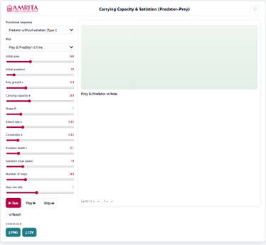
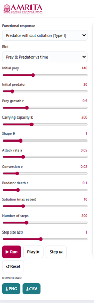
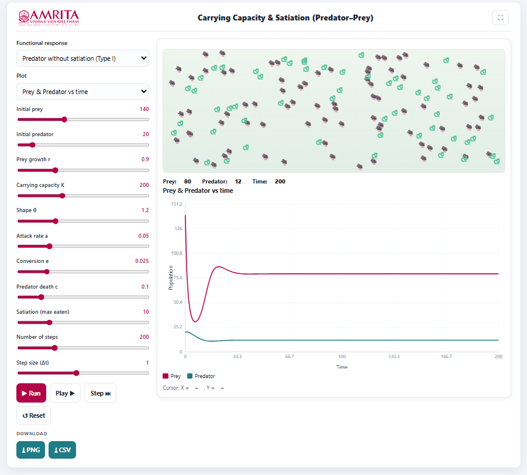

### Procedure

1. The simulator enables users to investigate predator–prey interactions by examining the combined effects of prey carrying capacity, predator functional response, and predator satiation on population dynamics. Users can configure ecological parameters, execute the simulation, and analyze how different predator feeding behaviors influence the temporal dynamics and stability of prey and predator populations.

 
&nbsp;

2. The simulator consists of a parameter panel on the left and a visualization panel on the right for displaying the selected graphical output.

 
&nbsp;

3. Select the predator functional response from the Functional response drop-down menu. The simulator provides different functional response models (e.g., Predator without satiation (Type I) and other available response types) for examining how predator feeding behaviour influences predator–prey interactions.
 
&nbsp;

4. Select the desired graphical output from the Plot drop-down menu. The simulator provides different graphical representations for analysing predator–prey population dynamics.
 
&nbsp;

5. Specify the initial prey population using the Initial prey slider. This parameter defines the number of prey individuals present at the beginning of the simulation.
 
&nbsp;

6. Specify the initial predator population using the Initial predator slider. This parameter defines the number of predator individuals initially present in the ecosystem.
 
&nbsp;

7. Adjust the intrinsic prey growth rate (r) using the corresponding slider. This parameter determines the rate at which the prey population increases in the absence of predation.
 
&nbsp;

8. Specify the prey carrying capacity (K) using the Carrying capacity slider. This parameter represents the maximum number of prey individuals that the environment can sustainably support.
 
&nbsp;

9. Adjust the shape parameter (θ) using the corresponding slider. This parameter modifies the form of the prey growth function and influences how the prey population approaches it carrying capacity.
 
&nbsp;

10. Adjust the predator attack rate (a) using the corresponding slider. This parameter represents the efficiency with which predators encounter and capture prey.
 
&nbsp;

11. Specify the conversion efficiency (e) using the corresponding slider. This parameter defines the proportion of consumed prey that is converted into predator population growth.
 
&nbsp;

12. Adjust the predator death rate (c) using the corresponding slider. This parameter represents the natural mortality rate of the predator population in the absence of sufficient prey.
 
&nbsp;

13. Specify the predator satiation limit using the Satiation (max eaten) slider. This parameter defines the maximum number of prey that an individual predator can consume during the simulation and allows the investigation of predator satiation effects.

&nbsp;

14. Set the total number of simulation steps using the Number of steps slider. This parameter determines the duration of the simulation.
 
&nbsp;

15. Adjust the simulation step size (Δt) using the Step size (Δt) slider. This parameter defines the numerical time interval used for solving the predator–prey equations. Smaller values generally improve numerical accuracy and simulation stability.
 
&nbsp;

16. After configuring all simulation parameters, click the Run button to execute the simulation and generate the selected graphical output.

 
&nbsp;

17. Alternatively, click the Play button to visualize the simulation continuously or click the Step button to advance the simulation one iteration at a time for detailed observation of predator–prey interactions.
 
&nbsp;

18. Observe the animation panel displayed above the graph. The animation provides a visual representation of the prey and predator populations as they change throughout the simulation.
 
&nbsp;

19. Monitor the population counters displayed below the animation panel to observe the current prey population, predator population, and simulation time at each stage of the simulation.
 
&nbsp;

20. Examine the graph displayed in the visualization panel. The graph illustrates the temporal variation in prey and predator populations under the selected functional response.
 
&nbsp;

21. Interpret the X-axis (Time) to determine the progression of the simulation and the Y-axis (Population) to examine the changes in prey and predator population sizes over time.Use the graph legend to distinguish between the Prey and Predator population curves.
 
&nbsp;

22. Observe the population trends to identify periods of prey growth, predator response, population decline, oscillations, and the eventual approach toward equilibrium or a stable population level.
 
&nbsp;

23. Compare the prey and predator curves to examine the relationship between prey availability and predator abundance. Observe how changes in prey population influence predator population dynamics over time.
 
&nbsp;

24. Modify one or more simulation parameters, such as the functional response type, carrying capacity, attack rate, predator satiation limit, conversion efficiency, or predator death rate, and execute the simulation again to investigate how these ecological factors influence predator–prey interactions.
 
&nbsp;

25. If required, click the Reset button to restore the default simulation parameters before performing another simulation.
 
&nbsp;

26. Download the graphical output by clicking the PNG button or export the numerical simulation data by clicking the CSV button for further quantitative analysis and comparison.
 
&nbsp;

27. Repeat the above procedure using different functional response models and parameter combinations to compare predator–prey dynamics under varying ecological conditions and evaluate the influence of carrying capacity and predator satiation on population stability.

* Observe the animation panel displayed above the graph. The animation provides a visual representation of changes in prey and predator populations throughout the simulation.

* Examine the graph displayed in the visualization panel to analyze how prey and predator populations change under the selected functional response and ecological parameters.

* If required, click the Reset button to restore the default simulation parameters before performing another simulation.

* Download the graphical output by clicking the PNG button or export the numerical simulation data by clicking the CSV button for further analysis and documentation.

* Repeat the above procedure using different combinations of functional response models, carrying capacity, predator satiation limits, attack rates, and other ecological parameters to compare their effects on predator–prey population dynamics, oscillatory behaviour, and system stability.

