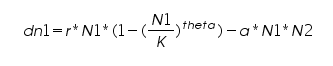

**Carrying capacity:** The maximum sustainable limit by the environment, either it is population density or the food sources.

&nbsp; 

**Satiation:** This can be explained with respect to predation rate. Predator/prey on reaching satiation indicates that they are saturated and no tendency to hunt more.

&nbsp; 

Consider a real field scenario, wherein snakes hunt frogs. The environment in which these predator/prey species exist has a specific carrying capacity. The frogs can grow at a specific growth rate and only can reach up to the carrying capacity for the frogs in that environment. If the frog population grows beyond that, then their population would be wiped out as all the available food resources would have been consumed. The most limiting factor in  nature is the food resource. The intrinsic growth rate of the prey population is controlled by predators. The prey species has to add the number of prey individuals equal to the number of prey individuals that have been removed by the predator. If they cannot maintain this balance, then both the species will become extinct.

Having said that, let us look into the example of snakes hunting down frogs. The snakes would hunt down at its maximum predation rate when it feels very hungry. Hungriness is the driving force for the maximum predation rate, which we refer to here as satiation. The rate of snakes hunting down frogs depends on the carrying capacity of the frogs in that environment. Imagine that frogs have a very high carrying capacity, which means that the probability for the snake to hunt down frogs would increase. On the contrary, it will have less probability to hunt down. In the former case, the snake can reach its maximum predation rate very easily and in the latter case, it cannot be reached rather easily. On the other way around if you see, the snake can become easily satiated in the former case while in the latter case, it does not become satiated that easily. So, carrying capacity plays a very important role in regulation the satiation factor in the predators.

While considering satiation parameter in the predator, another important factor needs to be considered. The predator on reaching satiation may not hunt down the prey, but can store the prey for future consumption. Considering all these dynamics, imagine that you would like to increase the population density of a certain snake species. The next obvious thing for achieve this is to increase the frog species population in that environment. You can simulate these dynamics using mathematical equations to test before proceeding to the actual field.

&nbsp;

Here are two different scenarios:

1. Increasing prey carrying capacity when the predator is not satiated.

2. Increasing prey carrying capacity when the predator is satiated.

We use the same logistic equations for the prey and predator as like in previous simulators. The prey dynamics is regulated by the equation:

 
&nbsp;

